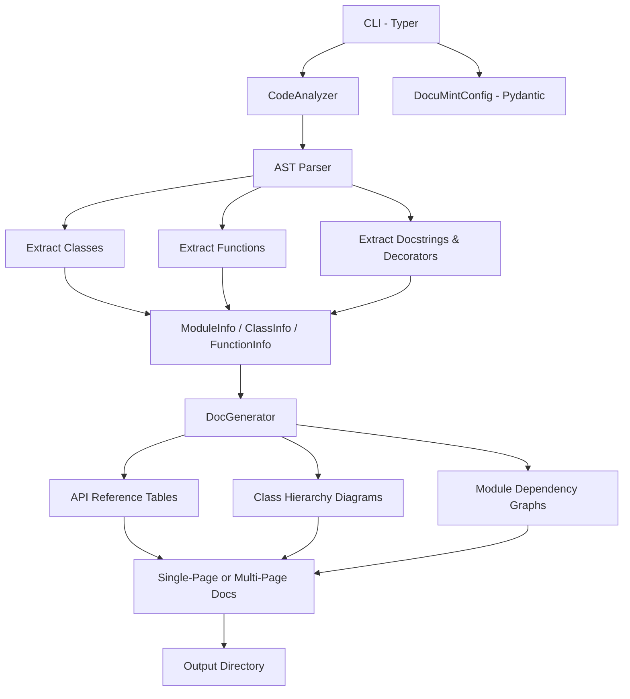

# DocuMint

[](https://github.com/MukundaKatta/DocuMint/actions/workflows/ci.yml)
[](https://www.python.org/downloads/)
[](LICENSE)
[](https://github.com/psf/black)

**Auto-generate beautiful Markdown documentation from your Python codebase -- AST-powered API reference and module docs.**

DocuMint parses your Python source files, extracts classes, functions, docstrings, and type annotations, then produces clean, structured Markdown documentation -- no manual effort required.

---

## Architecture



---

## Quickstart

### Installation

```bash
pip install -e .
```

### Generate documentation

```bash
# From a directory
documint generate src/myproject/ --output docs/

# From a single file
documint generate src/myproject/core.py --output docs/

# Single-page mode
documint generate src/myproject/ --output docs/ --format single
```

### Analyze without writing files

```bash
documint analyze src/myproject/
```

### Example output

Running `documint generate src/documint/ --output docs/api` produces:

```
docs/api/
  index.md          # Module index with summary table
  core.md           # Full docs for core.py
  config.md         # Full docs for config.py
  utils.md          # Full docs for utils.py
```

Each module page includes:

- Module docstring
- Dependency list (imports)
- Function summary table with return types
- Class documentation with method tables
- Text-based class hierarchy diagram
- Full function signatures with type annotations

---

## Features

- **Pure AST analysis** -- no imports or code execution required; safe for any codebase
- Extracts classes, methods, functions, decorators, and type annotations
- Preserves and formats docstrings
- Generates per-module docs, API reference tables, and a unified index
- Text-based class hierarchy diagrams and dependency graphs
- Single-page or multi-page output modes
- Configurable via CLI flags or environment variables
- Rich terminal output with progress indicators

---

## Configuration

| Option | CLI Flag | Env Var | Default |
| --- | --- | --- | --- |
| Output directory | `--output` / `-o` | `DOCUMINT_OUTPUT_DIR` | `docs/api` |
| Output format | `--format` / `-f` | `DOCUMINT_OUTPUT_FORMAT` | `multi` |
| Include private | `--private` | `DOCUMINT_INCLUDE_PRIVATE` | `false` |
| Include dunder | `--dunder` | `DOCUMINT_INCLUDE_DUNDER` | `false` |
| Project name | `--name` / `-n` | `DOCUMINT_PROJECT_NAME` | `API Reference` |

---

## Development

```bash
# Install dev dependencies
pip install -e ".[dev]"

# Run tests
make test

# Lint & format
make lint
make format

# Type check
make typecheck
```

---

## Project Structure

```
DocuMint/
  src/documint/
    __init__.py       # Package exports
    __main__.py       # CLI (Typer + Rich)
    core.py           # CodeAnalyzer & DocGenerator
    config.py         # Pydantic config model
    utils.py          # AST & Markdown helpers
  tests/
    test_core.py      # Unit tests
  docs/
    ARCHITECTURE.md   # Design documentation
  pyproject.toml      # Build & dependency config
  Makefile            # Dev shortcuts
  LICENSE             # MIT
```

---

## Inspired By

AI documentation tools like pdoc, Sphinx, and mkdocstrings -- reimagined for simplicity and speed.

---

Built by **Officethree Technologies** | Made with ❤️ and AI
